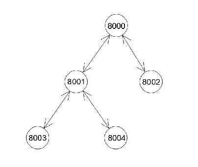
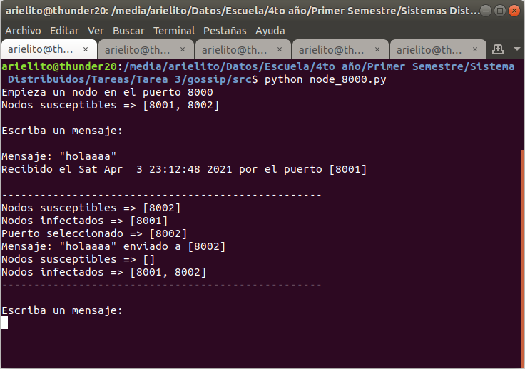
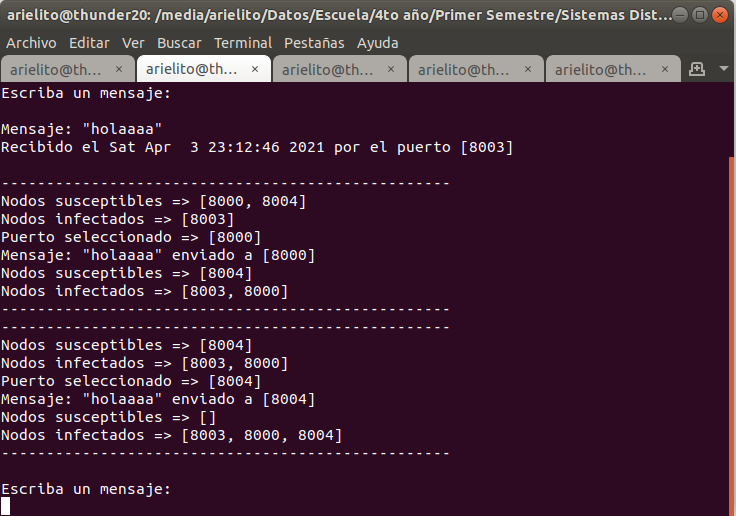

# Chat usando un modelo Gossip - Data Dissemination

## Sobre el autor

**Nombre y Apellidos** | **Correo** | **GitHub**
--|--|--
Ariel Plasencia Díaz | arielplasencia00@gmail.com | [@ArielXL](https://github.com/ArielXL)

## Sobre el chat

Es un ejemplo de chat simple basado en un modelo tipo Gossip - Data Dissemination, el cual, es un procedimiento o proceso de comunicación entre pares de nodos que se basa en la forma en que se propagan las epidemias. Algunos sistemas distribuidos utilizan dicho protocolo para garantizar que los datos se difundan a todos los miembros de un grupo.

## Sobre la implementación

La implementación se encuentra totalmente en [python 3](https://es.wikipedia.org/wiki/Python). Es recomendable tener conocimientos avanzados de este lenguaje de programación para una mayor y mejor entendimiento de las implementaciones propuestas.

## Sobre la ejecución

Para la ejecución, escriba las siguientes líneas en una terminal abierta en este directorio:

```bash
cd src/
python node_8000.py
python node_8001.py
python node_8002.py
python node_8003.py
python node_8004.py
```

Además, se pueden añadir nodos dinámicamente, haciendo:

```bash
cd src/
python add_node.py -o <ip> -p <port> -n <node_port> ... -n <node_port>
```

## Sobre la red Gossip - Data Dissemination

Para un mejor entendimiento de la relación de los nodos conectados propuesta por esta implementación veremos la siguiente figura:



Podemos apreciar que el nodo conectado por el puerto 8000 posee a los puertos 8001 y 8002 como nodos susceptibles, mientras que el nodo conectado por el puerto 8002 tiene al puerto 8000 como único nodo amigo. Por otra parte, el nodo seleccionado con el puerto 8001 presenta como nodos susceptibles a los puertos 8000, 8003, 8004, sin embargo estos dos últimos solo poseen al nodo 8001 como único nodo susceptible.

## Un ejemplo sencillo

A continuación, presentaremos un sencillo ejemplo que pone en evidencia la utilidad y eficiencia del algoritmo propuesto. Primeramente ejecutamos las siguientes líneas en una terminal abierta desde esta misma dirección:

```bash
cd src/
python node_8000.py
python node_8001.py
python node_8002.py
python node_8003.py
python node_8004.py
```

Si escribimos un mensaje desde el nodo con el puerto 8003, dicho mensaje le llegará a todos los nodos en nuestra pequeña red. Si nos fijamos en la figura anterior vemos que todos los nodos son alcanzables a partir del representado por el puerto 8003.




